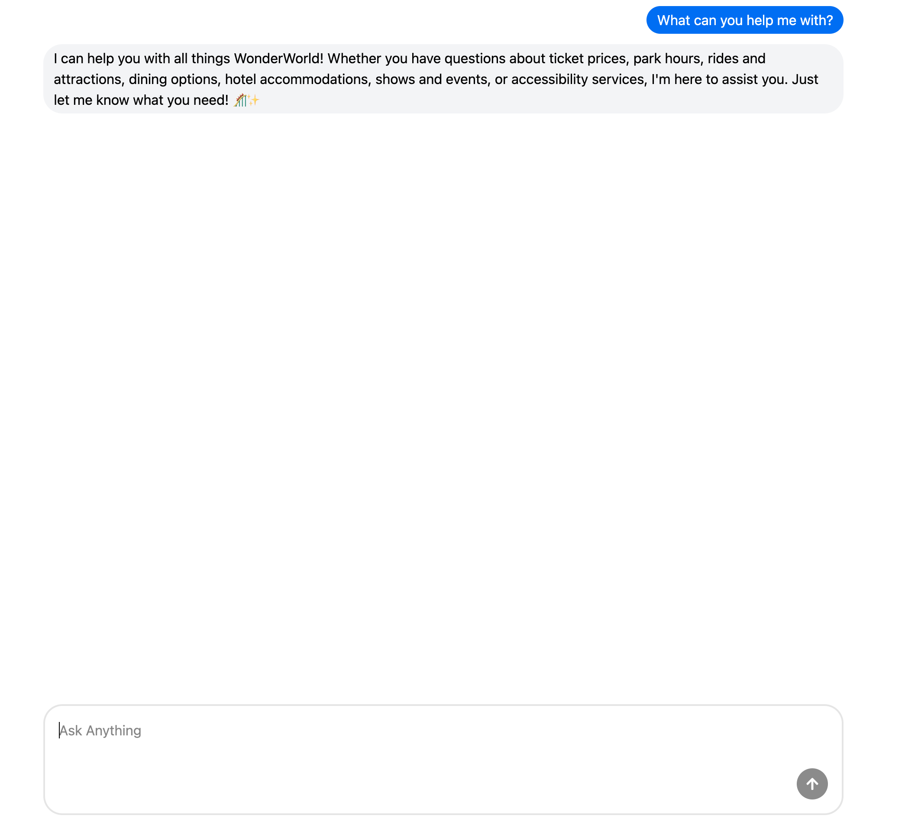

# ai-customer-service-bot

This project consists of a customer support service bot used to answer questiosn about a theme park. It includes prompting instructions to scope out the answers.



To install dependencies:

```bash
bun install
```

To run:

```bash
bun run dev
```
